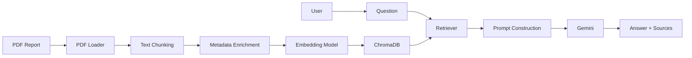
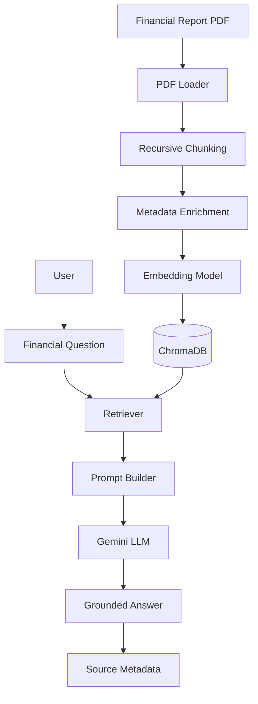
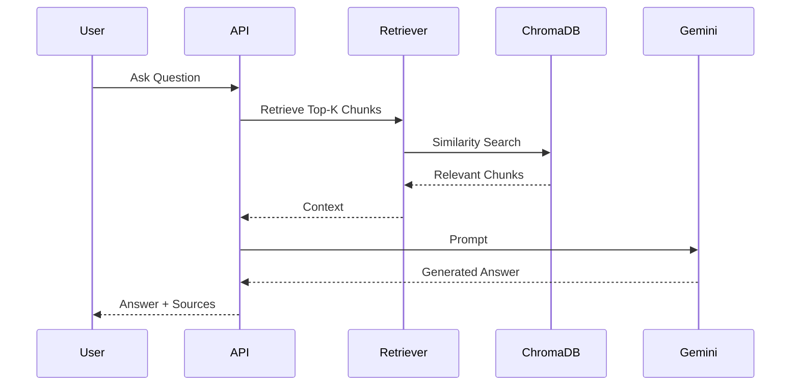

<div align="center">

# 🚀 AtlasIQ

### **AI-Powered Financial Research Assistant**

*Transforming Annual Reports into Actionable Intelligence using Retrieval-Augmented Generation (RAG), Large Language Models, and Semantic Search.*

<p align="center">


</p>

---

### 📈 Ask Questions. Retrieve Facts. Analyze Reports.

AtlasIQ is an **AI-powered Financial Research Assistant** designed to help analysts, investors, researchers, and finance professionals extract insights from lengthy annual reports using **Retrieval-Augmented Generation (RAG)**.

Instead of manually searching through hundreds of pages, AtlasIQ retrieves the most relevant document sections using semantic search and generates grounded, context-aware responses powered by modern LLMs.

</div>

---

# 🎥 Demo

> **📷 Coming Soon**

<p align="center">

| Dashboard | Semantic Search | Source Citation |
|------------|----------------|----------------|
| Coming Soon | Coming Soon | Coming Soon |

</p>

---

# ✨ Why AtlasIQ?

Financial reports often exceed **300–500 pages**, making manual analysis time-consuming and inefficient.

AtlasIQ simplifies financial research by enabling users to ask questions in natural language, such as:

- What are the major revenue sources?
- What risks does the company mention?
- How has operating profit changed?
- What are the management's future strategies?
- Which business segment contributed the most revenue?
- What ESG initiatives were introduced?

The system automatically retrieves the most relevant document chunks before generating an answer grounded in the report.

---

# 🚀 Key Features

## 📄 Intelligent PDF Processing

- Automatic PDF ingestion
- Page-wise document parsing
- Metadata extraction
- Smart recursive chunking
- Chunk overlap optimization

---

## 🧠 Semantic Search

- HuggingFace Embeddings
- Chroma Vector Database
- Similarity Search
- Top-K Retrieval
- Metadata-aware retrieval

---

## 🤖 AI-Powered Answers

- Gemini LLM Integration
- Context-aware generation
- Hallucination reduction
- Source-grounded responses
- Financial document understanding

---

## 📊 Retrieval-Augmented Generation (RAG)

✔ Document Loading

✔ Intelligent Chunking

✔ Vector Embeddings

✔ Vector Storage

✔ Semantic Retrieval

✔ Prompt Engineering

✔ LLM Response Generation

✔ Source Attribution

---

# 🌟 Core Capabilities

| Capability | Status |
|------------|--------|
| PDF Parsing | ✅ |
| RAG Pipeline | ✅ |
| Semantic Search | ✅ |
| ChromaDB | ✅ |
| HuggingFace Embeddings | ✅ |
| Gemini LLM | ✅ |
| Metadata Enrichment | ✅ |
| REST API | ✅ |
| Source Citation | ✅ |
| Multi-document Support | 🚧 |
| Hybrid Search | 🚧 |
| Cross Encoder Reranking | 🚧 |
| Financial Charts | 🚧 |

---

# 🛠 Technology Stack

## Backend

- FastAPI
- Python

## AI

- LangChain
- Google Gemini
- HuggingFace Embeddings

## Vector Database

- ChromaDB

## Document Processing

- PyMuPDF
- Recursive Character Text Splitter

## API

- FastAPI
- REST

## Future Frontend

- Next.js
- React
- Tailwind CSS

---

# 🏗 System Architecture

```text
                        User
                          │
                          ▼
                 Natural Language Query
                          │
                          ▼
                   FastAPI Backend
                          │
         ┌────────────────┴────────────────┐
         │                                 │
         ▼                                 ▼
    PDF Documents                     User Question
         │                                 │
         ▼                                 ▼
     PDF Loader                      Retriever
         │                                 │
         ▼                                 ▼
 Intelligent Chunking             Similarity Search
         │                                 │
         ▼                                 ▼
 Metadata Enrichment             Relevant Chunks
         │                                 │
         └──────────────┬──────────────────┘
                        ▼
                  Prompt Builder
                        │
                        ▼
                   Gemini LLM
                        │
                        ▼
              Context-Aware Answer
                        │
                        ▼
             Source Pages + Metadata
```

---

# 🔄 AtlasIQ Workflow



---

# 📦 Project Highlights

### ⚡ Fast Semantic Retrieval

Retrieve only the most relevant document sections instead of sending the entire report to the LLM.

---

### 📖 Source Grounding

Every response is backed by the originating document pages, improving transparency and trust.

---

### 🧩 Modular Architecture

The project separates responsibilities into independent modules for:

- Document Loading
- Chunking
- Embeddings
- Vector Storage
- Retrieval
- Prompting
- LLM Integration
- API Services

---

### 📈 Scalable Design

AtlasIQ is designed to evolve into a production-ready financial intelligence platform with support for:

- Multiple reports
- Multiple companies
- Advanced search
- Financial visualization
- Agentic workflows
- Enterprise knowledge bases

---

# 📌 Current Architecture

```
AtlasIQ
│
├── Document Loader
├── Intelligent Chunker
├── Metadata Processor
├── HuggingFace Embeddings
├── ChromaDB
├── Retriever
├── Prompt Builder
├── Gemini LLM
└── FastAPI
```

---

# ⭐ What Makes AtlasIQ Different?

Unlike traditional PDF chat applications, AtlasIQ focuses specifically on **financial intelligence**.

It is designed to support workflows such as:

- Equity Research
- Annual Report Analysis
- Company Comparison
- Financial Statement Review
- Investment Research
- Risk Assessment
- ESG Analysis
- Executive Decision Support

# 🚀 Getting Started

## 📋 Prerequisites

Before running AtlasIQ locally, ensure you have the following installed:

| Software | Version |
|-----------|----------|
| Python | 3.11+ |
| Git | Latest |
| pip | Latest |
| Google Gemini API Key | Required |

---

# ⚙️ Installation

## 1️⃣ Clone the Repository

```bash
git clone https://github.com/gaurishkale/AtlasIQ.git

cd AtlasIQ
```

---

## 2️⃣ Create Virtual Environment

### Windows

```bash
python -m venv .venv

.venv\Scripts\activate
```

### Linux / macOS

```bash
python3 -m venv .venv

source .venv/bin/activate
```

---

## 3️⃣ Install Dependencies

```bash
pip install -r requirements.txt
```

---

## 4️⃣ Configure Environment Variables

Create a `.env` file in the project root.

```env
GOOGLE_API_KEY=YOUR_GEMINI_API_KEY
```

---

## 5️⃣ Start FastAPI Server

```bash
python -m fastapi dev backend/main.py
```

Server:

```
http://127.0.0.1:8000
```

Swagger Docs:

```
http://127.0.0.1:8000/docs
```

Redoc:

```
http://127.0.0.1:8000/redoc
```

---

# 📂 Project Structure

```
AtlasIQ/

│
├── backend/
│   ├── main.py
│   ├── routes.py
│   └── services.py
│
├── rag/
│   ├── loader.py
│   ├── chunker.py
│   ├── embedder.py
│   ├── vector_store.py
│   ├── retriever.py
│   └── pipeline.py
│
├── llm/
│   └── chat.py
│
├── prompts/
│   └── rag_prompt.py
│
├── config/
│   └── settings.py
│
├── database/
│
├── data/
│   └── reports/
│
├── requirements.txt
│
├── .env
│
└── README.md
```

---

# 📁 Folder Overview

## backend/

Contains the FastAPI application responsible for exposing REST APIs.

Responsibilities

- API endpoints
- Request validation
- Response formatting
- Service layer

---

## rag/

Core Retrieval-Augmented Generation implementation.

Modules

✔ PDF Loading

✔ Text Chunking

✔ Metadata Enrichment

✔ Embeddings

✔ Chroma Vector Store

✔ Semantic Retrieval

✔ Pipeline Orchestration

---

## llm/

Responsible for interacting with Google Gemini.

Features

- Prompt execution
- Model abstraction
- Future multi-model support

---

## prompts/

Contains prompt templates used for retrieval-augmented generation.

Current Prompt

- Financial Question Answering Prompt

Future

- Comparative Analysis
- Financial Summarization
- Risk Analysis
- Earnings Report Prompt

---

## database/

Persistent ChromaDB storage.

Contains

- Vector embeddings
- Metadata
- Document chunks

Automatically created after document ingestion.

---

## data/

Stores uploaded financial reports.

Example

```
data/

└── reports/
    ├── tcs_annual_report.pdf
    ├── infosys_annual_report.pdf
    └── reliance_report.pdf
```

---

# 🔄 API Endpoints

## POST /ingest

Indexes a financial report into the vector database.

### Request

```json
{
  "pdf_path": "data/reports/tcs_annual_report.pdf"
}
```

---

### Response

```json
{
  "chunks": 1438
}
```

---

## POST /ask

Ask questions about the indexed report.

### Request

```json
{
  "question": "What are the major sources of revenue?"
}
```

---

### Response

```json
{
  "answer":"...",

  "sources":[
      {
          "page":54,
          "document":"tcs_annual_report.pdf",
          "company":"TCS",
          "chunk_id":184
      }
  ]
}
```

---

# 🧠 How AtlasIQ Works

Step 1

User uploads an annual report.

↓

Step 2

AtlasIQ loads the PDF page-by-page.

↓

Step 3

Each page is divided into overlapping chunks.

↓

Step 4

Metadata is attached.

↓

Step 5

Chunks are converted into embeddings.

↓

Step 6

Embeddings are stored in ChromaDB.

↓

Step 7

User asks a question.

↓

Step 8

Retriever finds the most relevant chunks.

↓

Step 9

Prompt Builder combines retrieved context.

↓

Step 10

Gemini generates a grounded answer.

↓

Step 11

AtlasIQ returns the answer along with source metadata.

---

# 📌 Supported Queries

Examples

✔ What are the company's major revenue streams?

✔ Explain the risk factors.

✔ What is the operating margin?

✔ Which business segment performed best?

✔ What acquisitions occurred this year?

✔ What sustainability initiatives were announced?

✔ Explain capital expenditure.

✔ What are management's future plans?

---

# 🧪 Example Workflow

```text
Upload PDF
     │
     ▼
/ingest
     │
     ▼
Vector Database
     │
     ▼
User Question
     │
     ▼
/ask
     │
     ▼
Retriever
     │
     ▼
Gemini
     │
     ▼
Final Answer
```

---

# 🛠 Configuration

Current Default Settings

| Parameter | Value |
|-----------|-------|
| Chunk Size | 1000 |
| Chunk Overlap | 200 |
| Embedding Model | BAAI/bge-base-en-v1.5 |
| Vector Database | ChromaDB |
| Retriever | Similarity Search |
| LLM | Gemini |
| Top-K Retrieval | 5 |

---

# 🧹 Reset Vector Database

Delete previous embeddings

Windows

```powershell
Remove-Item -Recurse -Force database
```

Linux/macOS

```bash
rm -rf database
```

Re-index

```
POST /ingest
```

---

# 🧩 Current Limitations

- Single-document retrieval
- Similarity search only
- English financial reports
- Text-based PDFs
- No OCR support
- No reranking
- No hybrid search
- No web interface (coming soon)
# 🧠 Deep Technical Architecture

AtlasIQ follows a modular **Retrieval-Augmented Generation (RAG)** architecture that combines document processing, semantic search, vector databases, and Large Language Models to generate grounded financial insights.

The system is designed around the principle:

> **Retrieve first. Generate second.**

Instead of sending an entire annual report to an LLM, AtlasIQ retrieves only the most relevant document chunks, reducing hallucinations, improving response quality, and lowering inference cost.

---

# 🏛 Overall System Architecture



---

# 🔄 End-to-End Processing Pipeline

## Phase 1 — Document Ingestion

Financial reports are loaded page-by-page using **PyMuPDF**.

Each page is preserved with its corresponding page number to enable accurate source attribution later in the retrieval process.

Example

```
Page 1

Chairman's Letter
```

↓

```
{
page:1,
content:"Chairman's Letter..."
}
```

---

## Phase 2 — Intelligent Chunking

Large documents cannot be embedded directly.

AtlasIQ divides each page into overlapping chunks using Recursive Character Text Splitting.

Default Configuration

| Parameter | Value |
|-----------|-------|
| Chunk Size | 1000 |
| Chunk Overlap | 200 |

Benefits

✔ Preserves context

✔ Prevents information loss

✔ Improves retrieval quality

✔ Handles long financial reports

---

# 📄 Chunk Example

Original Text

```
Revenue increased by 18%.

Operating Margin improved to 24%.

Cash Flow remained strong...
```

↓

Chunks

```
Chunk 1

Revenue increased by 18%...
```

```
Chunk 2

Operating Margin improved...
```

```
Chunk 3

Cash Flow remained...
```

Each chunk overlaps with neighboring chunks to preserve semantic continuity.

---

# 🏷 Metadata Enrichment

Every chunk is enriched with structured metadata before vectorization.

Current Schema

```json
{
    "chunk_id":184,
    "page":54,
    "document":"tcs_annual_report.pdf",
    "company":"TCS",
    "year":null
}
```

Why Metadata Matters

- Source attribution
- Company filtering
- Multi-document retrieval
- Better citations
- Future comparison workflows

---

# 🧬 Embedding Pipeline

AtlasIQ converts every document chunk into a dense semantic vector using **BAAI/bge-base-en-v1.5**.

```
Financial Text

↓

Embedding Model

↓

768-Dimensional Vector

↓

Vector Database
```

Unlike keyword search, embeddings capture semantic meaning rather than exact word matches.

Example

Query

```
Revenue Growth
```

can successfully retrieve

```
Top-line expansion
```

even without identical wording.

---

# 🗄 Vector Database Architecture

AtlasIQ uses **ChromaDB** for persistent vector storage.

Each stored record contains:

```
Embedding

+

Original Chunk

+

Metadata
```

Conceptually:

```
{
embedding:[0.25,0.83,...],

document:"...",

metadata:{
page:54,
company:"TCS"
}
}
```

This enables semantic retrieval while preserving traceability back to the source document.

---

# 🔍 Semantic Retrieval

When a user submits a question:

```
"What are the major revenue streams?"
```

AtlasIQ performs:

Question

↓

Embedding

↓

Similarity Search

↓

Top-K Relevant Chunks

↓

Prompt Construction

Only the most relevant chunks are forwarded to the LLM.

This dramatically reduces hallucinations.

---

# 🎯 Prompt Engineering

Retrieved chunks are assembled into a structured prompt before being sent to Gemini.

Prompt Structure

```
Retrieved Context

+

User Question

↓

Gemini

↓

Grounded Answer
```

This approach ensures that responses are generated from retrieved evidence rather than relying solely on the model's internal knowledge.

---

# 🤖 Large Language Model Layer

Current Model

Google Gemini

Responsibilities

- Context understanding
- Financial reasoning
- Natural language generation
- Answer synthesis
- Source-aware responses

AtlasIQ keeps the LLM layer modular, allowing future replacement with models such as:

- GPT-5
- Claude
- Llama
- Qwen
- DeepSeek

without changing the retrieval pipeline.

---

# 🔄 Request Lifecycle



---

# 📊 Data Flow

```
Financial Report

↓

Page Extraction

↓

Chunk Creation

↓

Metadata

↓

Embeddings

↓

ChromaDB

↓

Retriever

↓

Prompt Builder

↓

Gemini

↓

Answer

↓

Source Citation
```

---

# ⚡ Why Retrieval-Augmented Generation?

Traditional LLM

```
Question

↓

LLM

↓

Possible Hallucination
```

AtlasIQ

```
Question

↓

Retriever

↓

Verified Context

↓

LLM

↓

Grounded Response
```

Benefits

✅ Reduced Hallucinations

✅ Higher Accuracy

✅ Source Transparency

✅ Faster Retrieval

✅ Lower Token Usage

---

# 📈 Current Performance

| Metric | Value |
|---------|------:|
| Average PDF Size | 300–500 Pages |
| Current Test Report | 360 Pages |
| Chunks Generated | ~1,438 |
| Embedding Model | BAAI/bge-base-en-v1.5 |
| Vector Database | ChromaDB |
| Retrieval Method | Similarity Search |
| Default Top-K | 5 |
| API Framework | FastAPI |

---

# 🏗 Design Principles

AtlasIQ follows several software engineering principles:

### Separation of Concerns

Each component has a single responsibility:

- Loader
- Chunker
- Embedder
- Vector Store
- Retriever
- Prompt Builder
- LLM
- API Layer

---

### Modularity

Each module can be replaced independently.

Examples:

Replace

```
Gemini
```

with

```
Claude
```

or

```
GPT-5
```

without changing retrieval logic.

---

### Scalability

The architecture is designed to evolve toward:

- Hybrid Search
- Multi-document RAG
- Cross-Encoder Reranking
- Financial Knowledge Graphs
- Agentic AI Workflows
- SQL + RAG Integration
- Interactive Dashboards
- Enterprise Knowledge Bases

---

# 🔮 Future Architecture

```text
                    User
                      │
        ┌─────────────┴─────────────┐
        │                           │
   Financial Reports          Live Financial Data
        │                           │
        └─────────────┬─────────────┘
                      │
                Hybrid Retriever
                      │
      ┌───────────────┴───────────────┐
      │                               │
 Vector Search                  Keyword Search
      │                               │
      └───────────────┬───────────────┘
                      │
              Cross-Encoder Reranker
                      │
                Context Builder
                      │
                  Gemini / GPT
                      │
          Financial Research Assistant
```
---

# 🗺️ Roadmap

AtlasIQ is under active development. The following roadmap outlines planned improvements toward a production-ready AI Financial Intelligence Platform.

| Feature | Status |
|---------|:------:|
| PDF Ingestion | ✅ |
| Metadata-aware Chunking | ✅ |
| HuggingFace Embeddings | ✅ |
| ChromaDB Integration | ✅ |
| Gemini Integration | ✅ |
| REST API | ✅ |
| Source Attribution | ✅ |
| Multi-document RAG | 🚧 |
| Hybrid Search (BM25 + Vector) | 🚧 |
| Cross-Encoder Reranking | 🚧 |
| OCR Support | 🚧 |
| Financial Charts | 🚧 |
| Interactive Dashboard | 🚧 |
| Authentication | 🚧 |
| Cloud Deployment | 🚧 |
| Docker Support | 📅 Planned |
| Kubernetes Deployment | 📅 Planned |
| Knowledge Graph Integration | 💡 Future |
| Agentic Financial Research | 💡 Future |

---

# 📊 Performance Snapshot

Current benchmark using the TCS Annual Report.

| Metric | Value |
|---------|------:|
| Report Pages | 360 |
| Chunks Generated | ~1,438 |
| Chunk Size | 1000 |
| Chunk Overlap | 200 |
| Embedding Model | BAAI/bge-base-en-v1.5 |
| Vector Store | ChromaDB |
| Retrieval Strategy | Similarity Search |
| Top-K Retrieval | 5 |
| Backend Framework | FastAPI |

> **Note:** These values represent the current development configuration and may change as AtlasIQ evolves.

---

# 🧪 Example Use Cases

AtlasIQ can assist with:

### 📈 Equity Research

- Revenue analysis
- Segment performance
- Profitability trends

---

### 💰 Investment Research

- Business overview
- Growth opportunities
- Competitive positioning

---

### ⚠️ Risk Analysis

- Risk factors
- Legal proceedings
- Regulatory disclosures

---

### 🌱 ESG Analysis

- Sustainability initiatives
- Governance practices
- Environmental commitments

---

### 📑 Annual Report Exploration

Instead of reading hundreds of pages manually, ask:

- What were the company's major revenue drivers?
- Explain the risk factors.
- What changed compared to last year?
- Summarize management's outlook.
- What were the major acquisitions?

---

# 🔐 Security Considerations

Current implementation:

- Local vector database
- Environment variables for API keys
- No hardcoded credentials
- Source-grounded responses

Planned enhancements:

- User authentication
- Role-based access control
- Encrypted vector storage
- Secure document uploads
- Audit logging

---

# 🐳 Deployment

AtlasIQ currently supports local development.

Future deployment targets include:

- Docker
- Render
- Railway
- Azure
- AWS
- Google Cloud
- Kubernetes

---

# 🤝 Contributing

Contributions are welcome.

To contribute:

1. Fork the repository
2. Create a feature branch

```bash
git checkout -b feature/amazing-feature
```

3. Commit your changes

```bash
git commit -m "Add amazing feature"
```

4. Push your branch

```bash
git push origin feature/amazing-feature
```

5. Open a Pull Request

Please keep pull requests focused, documented, and tested where applicable.

---

# 💡 Future Vision

AtlasIQ aims to evolve beyond document question answering into a comprehensive AI-powered financial research platform.

Future capabilities may include:

- Multi-company comparison
- Financial ratio extraction
- Earnings call analysis
- Interactive dashboards
- Live market data integration
- SQL + RAG workflows
- Research report generation
- Portfolio insights
- Agentic financial research assistants

---

# 📸 Screenshots

> Screenshots and demo GIFs will be added as the user interface evolves.

Suggested sections:

```
/assets

├── dashboard.png
├── architecture.png
├── workflow.gif
├── api-demo.gif
└── retrieval.png
```

---

# ❓ Frequently Asked Questions

### Why use RAG instead of sending the whole PDF to an LLM?

Large annual reports often exceed an LLM's practical context window. Retrieval-Augmented Generation selects only the most relevant sections, improving efficiency and helping responses stay grounded in the document.

---

### Does AtlasIQ support multiple reports?

Not yet. Multi-document retrieval is planned.

---

### Can I use another LLM?

Yes. The architecture separates retrieval from generation, making it straightforward to replace the LLM layer with another compatible model.

---

### Which embedding model is used?

Current implementation:

```
BAAI/bge-base-en-v1.5
```

---

# 📚 References

AtlasIQ is built using modern AI and Python tooling, including:

- FastAPI
- LangChain
- ChromaDB
- Hugging Face Embeddings
- Google Gemini
- PyMuPDF

Refer to each project's official documentation for detailed usage and licensing information.

---

# 👨‍💻 Author

## Gaurish Kale

**AI/ML Engineer • Data Scientist • Generative AI Developer**

Building intelligent AI systems focused on:

- Retrieval-Augmented Generation (RAG)
- Machine Learning
- Large Language Models
- Financial AI
- Computer Vision
- Data Science

### Connect with me

- 💼 LinkedIn: https://www.linkedin.com/in/gaurishkale16
- 💻 GitHub: https://github.com/gaurishkale
- 📧 Email: your-email@example.com

---

# 🌟 Support the Project

If AtlasIQ helped you or inspired your work:

⭐ Star the repository

🍴 Fork the project

🐛 Report issues

💡 Suggest improvements

🤝 Contribute new features

Every contribution helps improve the project.

---

# 📄 License

This project is licensed under the **MIT License**.

See the `LICENSE` file for more information.

---

<div align="center">

## ⭐ If you found AtlasIQ useful, consider giving the repository a star!

**Turning Financial Documents into Actionable Intelligence with AI.**

Made with ❤️ using Python, FastAPI, LangChain, ChromaDB, Hugging Face, and Google Gemini.

</div>
