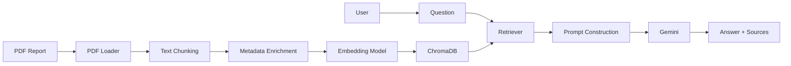

<div align="center">

# 🚀 AtlasIQ

### **AI-Powered Financial Research Assistant**

*Transforming Annual Reports into Actionable Intelligence using Retrieval-Augmented Generation (RAG), Large Language Models, and Semantic Search.*

<p align="center">


</p>

---

### 📈 Ask Questions. Retrieve Facts. Analyze Reports.

AtlasIQ is an **AI-powered Financial Research Assistant** designed to help analysts, investors, researchers, and finance professionals extract insights from lengthy annual reports using **Retrieval-Augmented Generation (RAG)**.

Instead of manually searching through hundreds of pages, AtlasIQ retrieves the most relevant document sections using semantic search and generates grounded, context-aware responses powered by modern LLMs.

</div>

---

# 🎥 Demo

> **📷 Coming Soon**

<p align="center">

| Dashboard | Semantic Search | Source Citation |
|------------|----------------|----------------|
| Coming Soon | Coming Soon | Coming Soon |

</p>

---

# ✨ Why AtlasIQ?

Financial reports often exceed **300–500 pages**, making manual analysis time-consuming and inefficient.

AtlasIQ simplifies financial research by enabling users to ask questions in natural language, such as:

- What are the major revenue sources?
- What risks does the company mention?
- How has operating profit changed?
- What are the management's future strategies?
- Which business segment contributed the most revenue?
- What ESG initiatives were introduced?

The system automatically retrieves the most relevant document chunks before generating an answer grounded in the report.

---

# 🚀 Key Features

## 📄 Intelligent PDF Processing

- Automatic PDF ingestion
- Page-wise document parsing
- Metadata extraction
- Smart recursive chunking
- Chunk overlap optimization

---

## 🧠 Semantic Search

- HuggingFace Embeddings
- Chroma Vector Database
- Similarity Search
- Top-K Retrieval
- Metadata-aware retrieval

---

## 🤖 AI-Powered Answers

- Gemini LLM Integration
- Context-aware generation
- Hallucination reduction
- Source-grounded responses
- Financial document understanding

---

## 📊 Retrieval-Augmented Generation (RAG)

✔ Document Loading

✔ Intelligent Chunking

✔ Vector Embeddings

✔ Vector Storage

✔ Semantic Retrieval

✔ Prompt Engineering

✔ LLM Response Generation

✔ Source Attribution

---

# 🌟 Core Capabilities

| Capability | Status |
|------------|--------|
| PDF Parsing | ✅ |
| RAG Pipeline | ✅ |
| Semantic Search | ✅ |
| ChromaDB | ✅ |
| HuggingFace Embeddings | ✅ |
| Gemini LLM | ✅ |
| Metadata Enrichment | ✅ |
| REST API | ✅ |
| Source Citation | ✅ |
| Multi-document Support | 🚧 |
| Hybrid Search | 🚧 |
| Cross Encoder Reranking | 🚧 |
| Financial Charts | 🚧 |

---

# 🛠 Technology Stack

## Backend

- FastAPI
- Python

## AI

- LangChain
- Google Gemini
- HuggingFace Embeddings

## Vector Database

- ChromaDB

## Document Processing

- PyMuPDF
- Recursive Character Text Splitter

## API

- FastAPI
- REST

## Future Frontend

- Next.js
- React
- Tailwind CSS

---

# 🏗 System Architecture

```text
                        User
                          │
                          ▼
                 Natural Language Query
                          │
                          ▼
                   FastAPI Backend
                          │
         ┌────────────────┴────────────────┐
         │                                 │
         ▼                                 ▼
    PDF Documents                     User Question
         │                                 │
         ▼                                 ▼
     PDF Loader                      Retriever
         │                                 │
         ▼                                 ▼
 Intelligent Chunking             Similarity Search
         │                                 │
         ▼                                 ▼
 Metadata Enrichment             Relevant Chunks
         │                                 │
         └──────────────┬──────────────────┘
                        ▼
                  Prompt Builder
                        │
                        ▼
                   Gemini LLM
                        │
                        ▼
              Context-Aware Answer
                        │
                        ▼
             Source Pages + Metadata
```

---

# 🔄 AtlasIQ Workflow



---

# 📦 Project Highlights

### ⚡ Fast Semantic Retrieval

Retrieve only the most relevant document sections instead of sending the entire report to the LLM.

---

### 📖 Source Grounding

Every response is backed by the originating document pages, improving transparency and trust.

---

### 🧩 Modular Architecture

The project separates responsibilities into independent modules for:

- Document Loading
- Chunking
- Embeddings
- Vector Storage
- Retrieval
- Prompting
- LLM Integration
- API Services

---

### 📈 Scalable Design

AtlasIQ is designed to evolve into a production-ready financial intelligence platform with support for:

- Multiple reports
- Multiple companies
- Advanced search
- Financial visualization
- Agentic workflows
- Enterprise knowledge bases

---

# 📌 Current Architecture

```
AtlasIQ
│
├── Document Loader
├── Intelligent Chunker
├── Metadata Processor
├── HuggingFace Embeddings
├── ChromaDB
├── Retriever
├── Prompt Builder
├── Gemini LLM
└── FastAPI
```

---

# ⭐ What Makes AtlasIQ Different?

Unlike traditional PDF chat applications, AtlasIQ focuses specifically on **financial intelligence**.

It is designed to support workflows such as:

- Equity Research
- Annual Report Analysis
- Company Comparison
- Financial Statement Review
- Investment Research
- Risk Assessment
- ESG Analysis
- Executive Decision Support

---

> **"Turning Financial Documents into Actionable Intelligence with Retrieval-Augmented Generation."**
