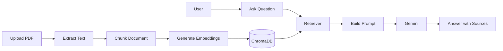

<div align="center">

# 🚀 AtlasIQ

### AI-Powered Financial Research Assistant

*Analyze annual reports using Retrieval-Augmented Generation (RAG), semantic search, and Large Language Models.*

<p align="center">


</p>

<p align="center">

<a href="#-demo">Demo</a> •
<a href="#-features">Features</a> •
<a href="#-architecture">Architecture</a> •
<a href="#-installation">Installation</a> •
<a href="#-api-reference">API</a>

</p>

</div>

---

## 📖 Overview

**AtlasIQ** is an AI-powered financial research assistant that enables users to interact with annual reports using natural language. Instead of manually searching through hundreds of pages, AtlasIQ retrieves the most relevant document sections using **Retrieval-Augmented Generation (RAG)** and generates grounded responses with source citations.

Built with **FastAPI**, **LangChain**, **Hugging Face Embeddings**, **ChromaDB**, and **Google Gemini**, AtlasIQ is designed to provide fast, accurate, and explainable insights from financial documents.

---

## 🚀 At a Glance

- 📄 Analyze 300+ page annual reports in seconds
- 🔍 Semantic search powered by Hugging Face embeddings
- 🧠 Retrieval-Augmented Generation (RAG)
- 🗄️ ChromaDB vector database for efficient retrieval
- 🤖 Google Gemini for context-aware responses
- 📑 Source-backed answers with page references
- ⚡ FastAPI REST API for seamless integration

---

## 🎥 Demo

> **Coming Soon**

Suggested additions:

- 📸 Dashboard Screenshot
- 🎥 Demo GIF
- 📖 Example Financial Report
- ⚡ Swagger API Preview

```
+--------------------------------------------------------------+
|                     AtlasIQ Dashboard                        |
|                                                              |
|  Question: What are the major revenue drivers?               |
|                                                              |
|  ✅ Revenue increased by 18% due to cloud services...         |
|                                                              |
|  Source: Page 54 – TCS Annual Report                         |
+--------------------------------------------------------------+
```

---
# ✨ Features

| Feature | Description |
|----------|-------------|
| 📄 Intelligent PDF Processing | Automatically ingests and processes annual reports using PyMuPDF. |
| 🧠 Retrieval-Augmented Generation | Retrieves relevant document chunks before generating responses. |
| 🔍 Semantic Search | Finds information based on meaning instead of exact keywords. |
| 🤖 AI-Powered Answers | Uses Google Gemini to generate grounded, context-aware responses. |
| 🗄️ Vector Search | Stores embeddings in ChromaDB for fast similarity search. |
| 📑 Source Attribution | Every answer includes document and page references for transparency. |
| ⚡ REST API | FastAPI-based endpoints for document ingestion and question answering. |

---

# 🛠️ Tech Stack

| Category | Technologies |
|----------|--------------|
| **Backend** | Python, FastAPI |
| **LLM** | Google Gemini |
| **Framework** | LangChain |
| **Embeddings** | Hugging Face (BAAI/bge-base-en-v1.5) |
| **Vector Database** | ChromaDB |
| **Document Processing** | PyMuPDF |
| **API Testing** | Swagger UI |
| **Version Control** | Git & GitHub |

---

# 🎯 Use Cases

AtlasIQ is designed for professionals and researchers working with financial documents.

### 📈 Financial Research
- Analyze annual reports
- Understand revenue drivers
- Explore business performance

### 💰 Investment Analysis
- Review financial statements
- Compare company performance
- Extract management insights

### ⚠️ Risk Assessment
- Identify business risks
- Review regulatory disclosures
- Analyze governance practices

### 📊 Enterprise Knowledge Search
- Search internal financial reports
- Retrieve document-specific insights
- Generate source-backed responses

---

# 📌 Current Capabilities

| Capability | Status |
|------------|:------:|
| Annual Report Ingestion | ✅ |
| Metadata-aware Chunking | ✅ |
| Semantic Search | ✅ |
| RAG Pipeline | ✅ |
| Hugging Face Embeddings | ✅ |
| ChromaDB Integration | ✅ |
| Google Gemini Integration | ✅ |
| FastAPI REST API | ✅ |
| Source Attribution | ✅ |
| Multi-document Retrieval | 🚧 Planned |
| Hybrid Search | 🚧 Planned |
| OCR Support | 🚧 Planned |

---

# 💡 Why AtlasIQ?

Unlike traditional PDF chat applications, AtlasIQ is purpose-built for **financial document analysis**.

Instead of sending an entire report to an LLM, AtlasIQ follows a **Retrieval-Augmented Generation (RAG)** workflow:

- 📄 Extracts and processes PDF documents
- ✂️ Splits content into optimized chunks
- 🧠 Generates semantic embeddings
- 🔍 Retrieves only the most relevant information
- 🤖 Produces grounded responses using Google Gemini
- 📑 Returns answers with source references

This approach improves **accuracy**, **reduces hallucinations**, and makes responses **traceable to the original document**.

---
# 🏗️ Architecture

AtlasIQ follows a modular **Retrieval-Augmented Generation (RAG)** architecture that transforms financial reports into searchable knowledge and generates grounded answers using an LLM.

```text
                          ┌──────────────────────────┐
                          │   Financial Report PDF   │
                          └─────────────┬────────────┘
                                        │
                                        ▼
                              ┌──────────────────┐
                              │   PDF Loader     │
                              └────────┬─────────┘
                                       │
                                       ▼
                            ┌─────────────────────┐
                            │ Text Chunking       │
                            │ + Metadata          │
                            └────────┬────────────┘
                                     │
                                     ▼
                          ┌────────────────────────┐
                          │ Hugging Face           │
                          │ Embedding Model        │
                          └────────┬───────────────┘
                                   │
                                   ▼
                          ┌────────────────────────┐
                          │      ChromaDB          │
                          │    Vector Database     │
                          └────────┬───────────────┘
                                   ▲
                                   │
                    ┌──────────────┴──────────────┐
                    │                             │
                    ▼                             │
            User Question                         │
                    │                             │
                    ▼                             │
             Semantic Retriever ──────────────────┘
                    │
                    ▼
            Retrieved Context
                    │
                    ▼
             Google Gemini
                    │
                    ▼
        Grounded Answer + Source Citation
```

---

# 🔄 Workflow



---

# ⚙️ How It Works

1. **Upload** a financial report in PDF format.
2. AtlasIQ extracts text and preserves page-level metadata.
3. The document is split into overlapping chunks for better context retention.
4. Each chunk is converted into semantic embeddings using **BAAI/bge-base-en-v1.5**.
5. Embeddings are stored in **ChromaDB** for efficient similarity search.
6. When a user asks a question, AtlasIQ retrieves the most relevant document chunks.
7. The retrieved context is sent to **Google Gemini** to generate a grounded response.
8. The final answer is returned along with the corresponding document and page references.

---

# 📂 Project Structure

```text
AtlasIQ
│
├── backend/          # FastAPI application
├── rag/              # RAG pipeline
│   ├── loader.py
│   ├── chunker.py
│   ├── embedder.py
│   ├── vector_store.py
│   ├── retriever.py
│   └── pipeline.py
│
├── llm/              # Gemini integration
├── prompts/          # Prompt templates
├── config/           # Configuration
├── database/         # ChromaDB storage
├── data/reports/     # Financial reports
├── requirements.txt
└── README.md
```

---

## 🎯 Design Highlights

- **Modular Architecture** – Each component has a single responsibility, making the system easy to extend and maintain.
- **Semantic Retrieval** – Uses embeddings instead of keyword matching to improve search relevance.
- **Grounded Responses** – Answers are generated only from retrieved document context, reducing hallucinations.
- **Scalable Design** – Supports future enhancements such as multi-document retrieval, hybrid search, reranking, and additional LLMs without major architectural changes.

---
# ⚙️ Installation

## Prerequisites

Before getting started, ensure you have the following installed:

| Requirement | Version |
|-------------|---------|
| Python | 3.11+ |
| Git | Latest |
| pip | Latest |
| Google Gemini API Key | Required |

---

## 1. Clone the Repository

```bash
git clone https://github.com/gaurishkale/AtlasIQ.git

cd AtlasIQ
```

---

## 2. Create a Virtual Environment

### Windows

```bash
python -m venv .venv

.venv\Scripts\activate
```

### Linux / macOS

```bash
python3 -m venv .venv

source .venv/bin/activate
```

---

## 3. Install Dependencies

```bash
pip install -r requirements.txt
```

---

## 4. Configure Environment Variables

Create a `.env` file in the project root.

```env
GOOGLE_API_KEY=your_google_gemini_api_key
```

---

## 5. Start the API Server

```bash
python -m fastapi dev backend/main.py
```

The application will be available at:

| Service | URL |
|----------|-----|
| API | http://127.0.0.1:8000 |
| Swagger UI | http://127.0.0.1:8000/docs |
| ReDoc | http://127.0.0.1:8000/redoc |

---

# 📡 API Reference

## POST `/ingest`

Indexes a financial report into the vector database.

### Request

```json
{
    "pdf_path": "data/reports/tcs_annual_report.pdf"
}
```

### Success Response

```json
{
    "chunks": 1438
}
```

---

## POST `/ask`

Retrieves relevant document sections and generates a grounded answer.

### Request

```json
{
    "question": "What are the company's major revenue sources?"
}
```

### Response

```json
{
    "answer": "...",
    "sources": [
        {
            "page": 54,
            "document": "tcs_annual_report.pdf",
            "company": "TCS",
            "chunk_id": 184
        }
    ]
}
```

---

# 📌 Example Workflow

### Step 1 — Index a Report

```text
POST /ingest
        │
        ▼
PDF → Chunking → Embeddings → ChromaDB
```

### Step 2 — Ask Questions

```text
POST /ask
        │
        ▼
Question → Retriever → Gemini → Answer + Sources
```

---

# 🛠 Configuration

| Parameter | Default |
|------------|---------|
| Embedding Model | BAAI/bge-base-en-v1.5 |
| LLM | Google Gemini |
| Vector Database | ChromaDB |
| Chunk Size | 1000 |
| Chunk Overlap | 200 |
| Retrieval Strategy | Similarity Search |
| Top-K Retrieval | 5 |

---

# 🧹 Reset the Vector Database

If you want to re-index documents from scratch:

### Windows

```powershell
Remove-Item -Recurse -Force database
```

### Linux / macOS

```bash
rm -rf database
```

Then run:

```text
POST /ingest
```

to generate a fresh vector database.

---
# 🗺️ Roadmap

AtlasIQ is actively evolving into a production-ready AI platform for financial document analysis.

| Feature | Status |
|----------|:------:|
| PDF Processing | ✅ |
| RAG Pipeline | ✅ |
| Semantic Search | ✅ |
| Hugging Face Embeddings | ✅ |
| ChromaDB Integration | ✅ |
| Google Gemini Integration | ✅ |
| FastAPI REST API | ✅ |
| Source Attribution | ✅ |
| Multi-document Support | 🚧 |
| Hybrid Search (BM25 + Vector) | 🚧 |
| Cross-Encoder Reranking | 🚧 |
| OCR Support | 🚧 |
| React Dashboard | 📅 Planned |
| Docker Deployment | 📅 Planned |

---

# 📊 Performance

Current development configuration.

| Metric | Value |
|---------|------:|
| Tested Report | TCS Annual Report |
| Report Size | 360 Pages |
| Chunks Generated | ~1,438 |
| Embedding Model | BAAI/bge-base-en-v1.5 |
| Vector Database | ChromaDB |
| Retrieval Strategy | Similarity Search |
| Default Top-K | 5 |

---

# 🎯 Example Use Cases

AtlasIQ can assist with:

- 📈 Annual Report Analysis
- 💰 Investment Research
- 📊 Financial Statement Exploration
- ⚠️ Risk Assessment
- 🌱 ESG Analysis
- 🏢 Enterprise Knowledge Search

Example questions:

- What are the company's major revenue drivers?
- Explain the key business risks.
- Summarize the management discussion.
- What sustainability initiatives were introduced?
- Which segment generated the highest revenue?

---

# 🤝 Contributing

Contributions are welcome.

1. Fork the repository
2. Create a new feature branch

```bash
git checkout -b feature/new-feature
```

3. Commit your changes

```bash
git commit -m "Add new feature"
```

4. Push your branch

```bash
git push origin feature/new-feature
```

5. Open a Pull Request

---

# 🚀 Future Vision

AtlasIQ is designed as the foundation for an AI-powered Financial Intelligence Platform.

Future enhancements include:

- Multi-company comparison
- Financial ratio extraction
- Earnings call analysis
- Interactive dashboards
- Live financial data integration
- Agentic AI workflows
- Enterprise knowledge bases

---

# 👨‍💻 Author

## Gaurish Kale

**AI/ML Engineer • Data Scientist • Generative AI Developer**

Passionate about building intelligent AI systems using:

- Retrieval-Augmented Generation (RAG)
- Machine Learning
- Large Language Models
- Financial AI
- Computer Vision

### Connect with me

- 💼 LinkedIn: https://www.linkedin.com/in/gaurishkale16
- 💻 GitHub: https://github.com/gaurishkale

---

# ⭐ Support

If you found AtlasIQ useful:

- ⭐ Star the repository
- 🍴 Fork the project
- 🐛 Report issues
- 💡 Suggest improvements

Your support helps improve the project.

---

# 📄 License

This project is licensed under the **MIT License**.

See the `LICENSE` file for more information.

---

<div align="center">

### ⭐ Transforming Financial Documents into Actionable Intelligence with AI

Built with **FastAPI • LangChain • ChromaDB • Hugging Face • Google Gemini**

</div>

